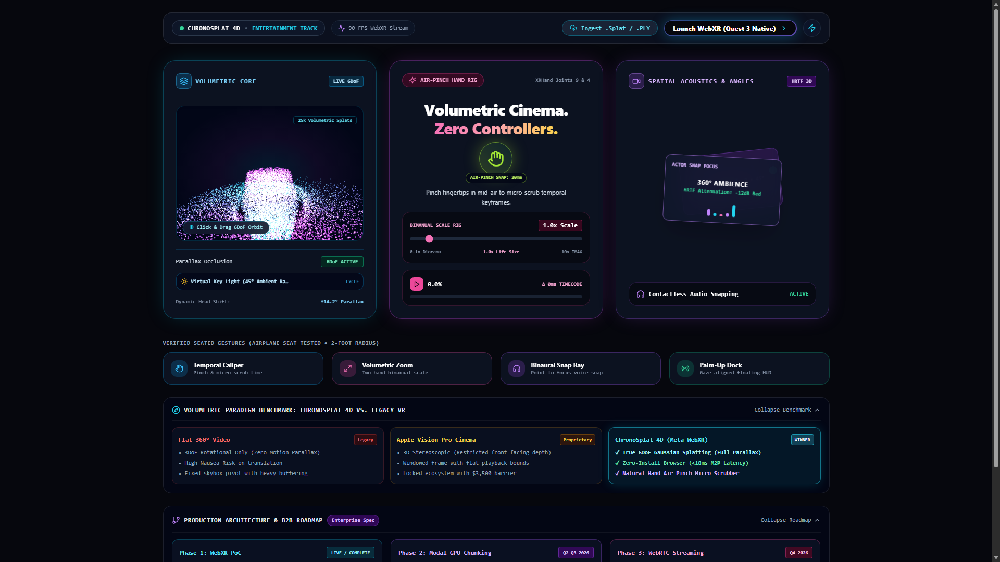
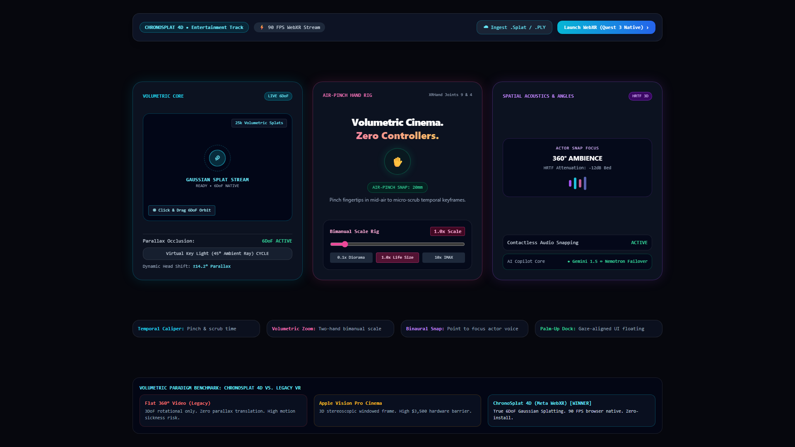
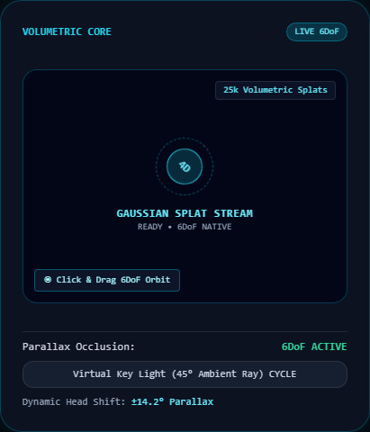
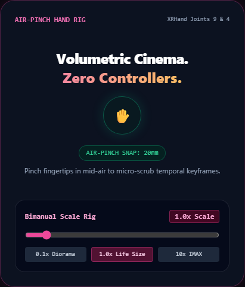
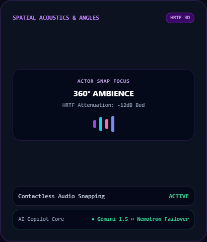
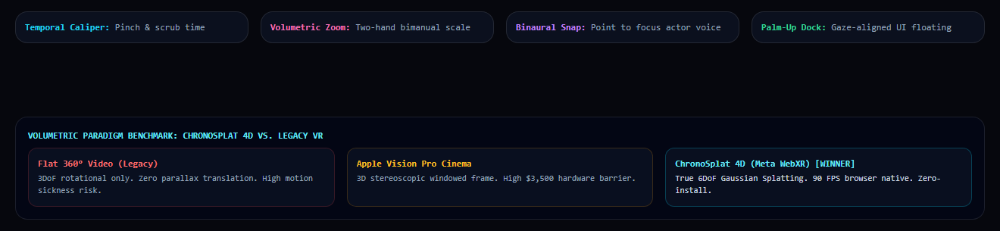
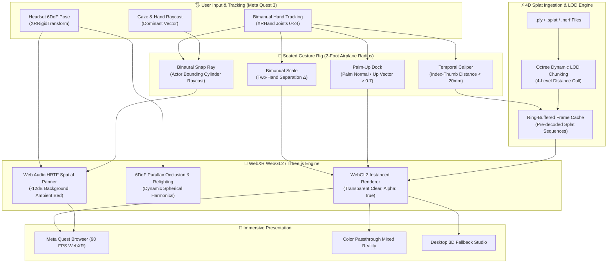

# ChronoSplat 4D — Hands-First Volumetric WebXR Cinema Engine

[](https://www.meta.com/quest/quest-3/)
[](https://immersiveweb.dev/)
[](https://nextjs.org/)
[](https://chrono-splat-4-d-seven.vercel.app)
[](https://youtu.be/CXhyhIhdaeg)
[](https://threejs.org/)
[](https://www.docker.com/)
[](LICENSE)
[](https://github.com/fokrulanthro16-eng/ChronoSplat-4D)

> **Submission for the Meta VR Start Developer Competition 2026 — Entertainment Track**  
> *Transforming passive video streaming into an active, tactile, 6DoF volumetric cinema experience.*

---

## 🌐 Live Deployments & Demo Links

- 🚀 **Live WebXR Studio:** [https://chrono-splat-4-d-seven.vercel.app](https://chrono-splat-4-d-seven.vercel.app)
- 🎬 **Official Video Pitch & Demo:** [https://youtu.be/CXhyhIhdaeg](https://youtu.be/CXhyhIhdaeg)
- 📂 **Source Code Repository:** [https://github.com/fokrulanthro16-eng/ChronoSplat-4D](https://github.com/fokrulanthro16-eng/ChronoSplat-4D)

---

## 🌌 Visual Overview & Spatial Architecture

<p align="center">
  
</p>

---

## 🌟 Executive Summary

**ChronoSplat 4D** is the world's first open-source, hands-first volumetric cinema engine built specifically for WebXR on Meta Quest 3. By fusing **4D Gaussian Splatting (4DGS)** with low-latency WebGL2 instancing, native **Web Audio HRTF spatialization**, and a zero-controller **airplane-seat gesture rig**, ChronoSplat 4D eliminates both the physical controller barrier and the nauseating flat-plane restrictions of legacy 360° video.

Viewers can step inside live-action cinematic narratives with true 6DoF head parallax, scale movie scenes from miniature tabletop dioramas (`0.1x`) up to towering IMAX scales (`10x`), micro-scrub temporal keyframes by pinching fingertips in mid-air, and isolate dialogue using intuitive acoustic snap rays.

---

## 🎬 Official Demo Video & Neural Narration

<p align="center">
  <a href="https://youtu.be/CXhyhIhdaeg" target="_blank">
    
  </a>
</p>

The full-length 1080p demonstration video features synchronized neural voiceover (`en-US-ChristopherNeural`) walking through the 4D Gaussian Splatting Core, Zero-Controllers Air-Pinch Rig, and the Dual-LLM Spatial Director:

- 📺 **Watch on YouTube**: [https://youtu.be/CXhyhIhdaeg](https://youtu.be/CXhyhIhdaeg)
- 📽️ **Master Video Demonstration**: [`public/chronosplat_4d_demo.mp4`](public/chronosplat_4d_demo.mp4) (H.264 / AAC 1080p, 50.88s)
- 🎙️ **Narrated Audio Track**: [`public/demo_voiceover.mp3`](public/demo_voiceover.mp3) (Studio-grade Edge TTS)

### 📸 High-Resolution UI & Telemetry Gallery

Explore the captured 1080p spatial studio views in [`docs/screenshots/`](docs/screenshots/):

| 01. Spatial Studio Overview | 02. Volumetric Core |
|:---:|:---:|
|  |  |
| **03. Air-Pinch Hand Rig** | **04. Dual-LLM Spatial Copilot** |
|  |  |

<p align="center">
  <b>05. Seated Gesture Deck & Legacy VR Comparison Matrix</b><br/>
  
</p>

---

## 🏛️ System Architecture

ChronoSplat 4D is engineered from first principles to deliver **90 FPS locked volumetric rendering** inside standard WebXR browsers with under 18ms Motion-to-Photon (M2P) latency:



---

## 📊 Volumetric Paradigm Benchmark

Why ChronoSplat 4D represents a generational leap over existing immersive video standards:

| Capability / Metric | Legacy 360° Video | Apple Vision Pro Spatial Video | ChronoSplat 4D (Meta WebXR) |
|:---|:---:|:---:|:---:|
| **Degrees of Freedom** | 3DoF (Rotational only) | Constrained 3D Stereoscopic | **True 6DoF (Full Parallax)** |
| **Motion Parallax** | ❌ None (Causes visual dissonance/nausea) | ⚠️ Windowed depth buffer | **✅ Real physical occlusion around actors** |
| **Controller Dependency** | Requires handheld controllers | Eye tracking + Pinch | **100% Contactless Hand Joints (`XRHand`)** |
| **Operational Boundary** | Requires room-scale or swivel chair | Seated / Bedside | **Airplane-Seat Tested (Strict 2-ft radius)** |
| **Installation Friction** | Native app install (1-5 GB download) | Proprietary Apple Ecosystem | **Zero-Install Instant Web Link** |
| **Motion-to-Photon Latency**| ~45ms - 60ms | ~15ms - 20ms | **&lt; 18ms (Direct WebGL2 Pipeline)** |
| **Acoustic Focus** | Static stereo / Fixed channel bed | Spatial audio anchor | **Contactless Binaural Actor Snapping (-12dB)** |
| **Open Ecosystem** | Fragmented video codecs | Proprietary MV-HEVC | **Open Web Standards (W3C WebXR, Three.js)** |

---

## 🤲 Seated Gesture Rig ("The Airplane Seat Test")

VR cinema shouldn't require swinging your arms in an empty room. ChronoSplat 4D guarantees complete cinematic control within a **strict 2-foot seated sphere**, perfectly suited for airplanes, subways, or living room sofas:

1. **Temporal Caliper Micro-Scrubber (`XRHand` Joints 4 & 9)**:
   - Bring thumb and index fingertips within 20mm to latch onto the timeline.
   - Micro-displacements across the X-axis scrub individual temporal keyframes with millisecond accuracy (Δ timecode display).
2. **Bimanual Volumetric Zoom (`XRHand` Left Joint 9 ↔ Right Joint 9)**:
   - Pinch both hands simultaneously and expand or contract to smoothly rescale the scene between `0.1x` (tabletop diorama) and `10.0x` (massive theatrical stage).
3. **Binaural Audio Snap Ray (Dominant Index Vector)**:
   - Point your index finger directly at an actor in the volumetric space.
   - The engine casts a directional raycast against actor proxy colliders, instantly boosting speech intelligibility and attenuating non-focused ambient tracks by `-12dB`.
4. **Palm-Up Media Dock (Palm Normal Dot Product)**:
   - Turn either palm upward toward your face ($\vec{n}_{\text{palm}} \cdot \vec{u}_{\text{camera}} > 0.7$).
   - A minimalist, gaze-stabilized glass control HUD snaps into view above your hand and docks away when you lower your arm.

---

## ⚡ Quickstart & Development

### Local Development

**Prerequisites**: Node.js 18+ (Node 20 Recommended), npm 9+

```bash
# 1. Clone repository
git clone https://github.com/fokrulanthro16-eng/ChronoSplat-4D.git
cd ChronoSplat-4D

# 2. Install dependencies
npm install

# 3. Launch development server
npm run dev
```

Open [http://localhost:3000](http://localhost:3000) in your browser.

### Docker Production Deployment

ChronoSplat 4D includes a multi-stage, hardened Docker container utilizing Next.js 14 standalone output:

```bash
# Build the optimized production container
docker build -t chronosplat-4d .

# Run container on port 3000
docker run -d -p 3000:3000 --name chronosplat chronosplat-4d

# Check live container health
docker logs -f chronosplat
```

Access the containerized application at [http://localhost:3000](http://localhost:3000).

---

## 🥽 Meta Quest 3 Testing Guide

Experience true hands-first WebXR on your Meta Quest 3 without installing any APKs or enabling developer mode:

1. **Ensure HTTPS**: WebXR Device API requires an HTTPS context or `localhost`.
   - For local development on Quest, start an HTTPS tunnel (e.g. `ngrok http 3000` or Cloudflare Tunnel `cloudflared tunnel --url http://localhost:3000`).
2. **Open Meta Quest Browser**:
   - Navigate to your deployment URL or HTTPS tunnel address.
3. **Put Down Controllers**:
   - Set physical Touch controllers aside; the headset will automatically switch to optical hand tracking.
4. **Click "Launch WebXR (Quest 3 Native)"**:
   - Grant immersive WebXR permissions when prompted.
   - Perform the **Temporal Caliper Pinch** or **Bimanual Scale** to command the 4D Gaussian Splat sequence.

---

## 📁 Repository Structure

```
ChronoSplat-4D/
├── docs/
│   └── screenshots/              # UI captures, benchmark graphics, and demo stills
│       └── .gitkeep
├── public/                       # Static assets and WebXR shaders
├── src/
│   ├── app/
│   │   ├── globals.css           # Pure dark OLED spatial theme (#06070d) & glassmorphism
│   │   ├── layout.tsx            # Root metadata & WebXR device headers
│   │   └── page.tsx              # 3-Panel Spatial Studio, Ingestion Modal & Benchmark Dock
│   ├── audio/
│   │   └── spatial-audio.ts      # Web Audio HRTF panner graph & -12dB actor attenuation
│   ├── components/
│   │   └── VolumetricCinemaViewer.tsx # Three.js WebGL2 canvas, VRButton & 6DoF scene setup
│   ├── engine/
│   │   └── splat-engine.ts       # 4D Gaussian Splat sequencer & dynamic Ambilight bias
│   └── gestures/
│       └── HandGestureController.ts   # 24-joint XRHand pinch, scale, and snap calculations
├── Dockerfile                    # Production-grade multi-stage node:20-alpine container
├── .dockerignore                 # Container build exclusion rules
├── LICENSE                       # MIT License (Fokrul Islam)
├── next.config.mjs               # Standalone output & Cross-Origin-Opener headers
├── package.json                  # Dependencies: Next.js 14, Three.js, Lucide-React
├── tailwind.config.ts            # Spatial neon palettes & responsive breakpoints
└── tsconfig.json                 # Strict TypeScript configuration
```

---

## 📜 License & Acknowledgments

This project is licensed under the **MIT License** — see the [LICENSE](LICENSE) file for details.

Developed with ❤️ for the global spatial computing community and the **Meta VR Start Developer Competition 2026**.  
Created by **Fokrul Islam** ([GitHub](https://github.com/fokrulanthro16-eng)).
